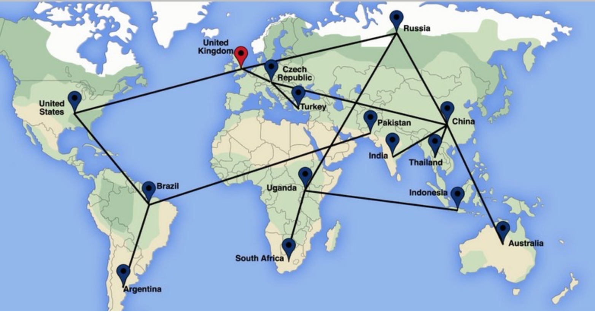
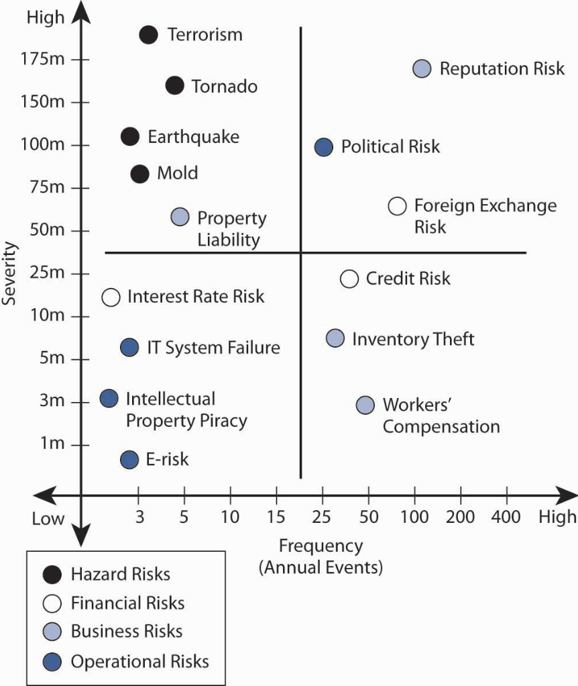
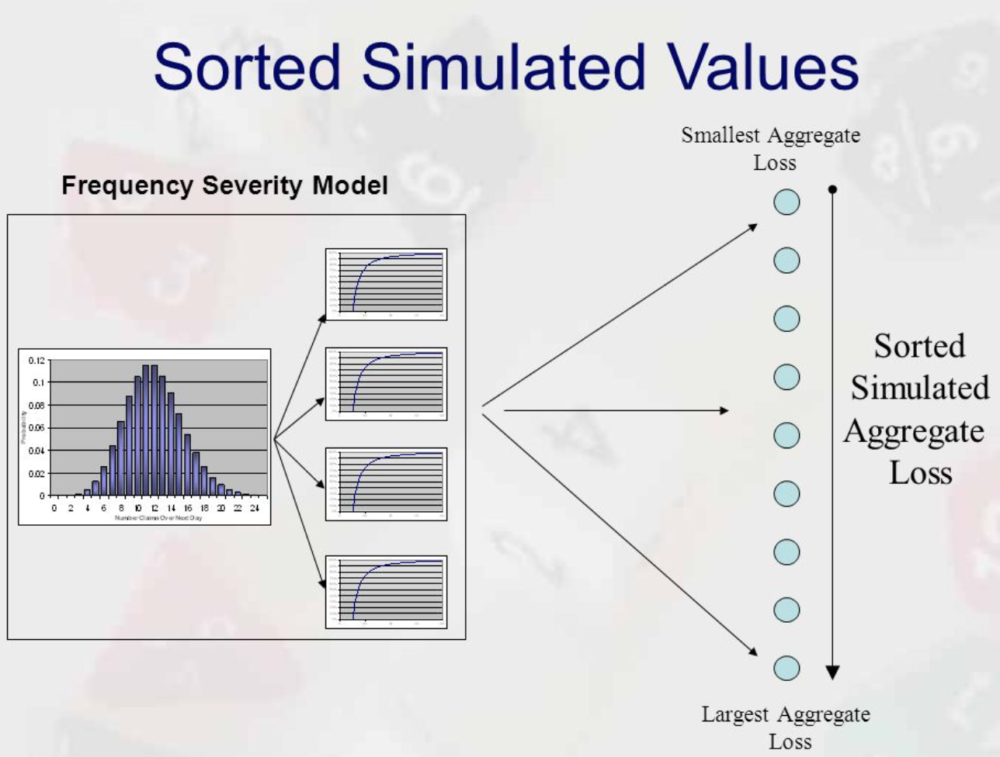

```{r setup, include=FALSE}
knitr::opts_chunk$set(echo = TRUE)
```





#1.Locations


* Buenos Aires

* Paris

* Melbourne

* Saint Petersburg

* Abidjan

* Nairobi

* Salvador

* Mumbai

*Mexico city

* Tijuana 

* Casablanca

* Istanbul

* Arteixo

* Montreal

* Ankara

* Monterrey

* Roma 

* Porto


#2.Types of Risks

###Financial Risk:

Credit Default

Interest Rate fluctuations

Fuel prices

Tax Laws Changes

Liquidity/Cash

Economic Recessions

### Hazard Risk:

Natural disasters(Earthquake/cyclones)

Wildfire,Tornadoes

Cargo losses

Building fire

Facility loss

Product liability

###Strategic Risk:

New Technology

New competition 

Change in demand 

Negative Media

Technologies choies

Ethic violation

###Operations Risk

Suppliers issues(Key supplier loss)

Cyber Attack

Theft of intellectual and technical ressources

Loss of key personnel 

Health and safety violations

Logistic issues(route failures)

#3.Impacts and consequences of risk:




No matter the origine or the type of disruptions ,the result could be expressed in term of loss of one of those capcities from the company standpoint:

Capacity to acquire material(raw material from suppliers)

Capacity to ship or transport(which can increase the lead time and the responsiveness of the chain)

Human ressources

Financial flows (big loss in return or values,issues with continuity in the business)

#4. Preparing and handling a disruption

###4.1-Preparation 

The company should have a plan in place 

###4.2-Disruptive event occurs

Take note

###4.3-First Response

company should try to deliver first aid response

###4.4-Initial impact 

assess initial impact

###4.5-Time of full impact

###4.6-Recovery preparation

###4.7-Recovery 

###4.8-Longterm impact assessment 


#5. Risk management Framework 

###5.1.vulnerability assessment
a.

Mapping the supply chain through visualization of all the nodes
locating and knowing the upstream tiers 1,2,3 & downstream to customers

b.

Analyzing the sources of risk 

* Natural disasters predictability by region (even by season if possible)

* Terrorism :threat adjusts to prevention(what could be at great risk and where in the supply chain)

* Labor unrest:threat often adjusts to preventive actions

* Suppliers failure : requires close monitoring (monitoring the financial health of your tiers)

c.

Risk analytics: quantitative and qualitative:

* Assess probabilities of disruptions

* Assess impact and consequences of disruption

* Issues : data hard to collect for forecasting and assessment


###5.2.Mitigation planning and implementation

Identify  options for reducing probabilities and impacts(consequences)

Identify the company risk profile

Choose the right mix of each for the business

choose between prevention or response :how much of each

Reducing Probability :security and prevention

Reducing Impacts :response and resilience


###5.3.Ongoing Monitoring and Measurement

Design and install monitoring  system 

Global event monitoring :geographic,political,weather

Supplier operational and financial health

Monitoring the entire network  find all the sources

Install measurement systems

* Leadtime

* Time to recover(TTR):number of days or weeks to restore 100% operational output following a  supply disruption

* Set targets and use flexibility and redundancy to hit target

Mapping the supply chain risk network

Maintaining suppliers databases


###5.4.Crisis Management & Response

Develop response playbooks

Impact analysis:

on customers ,facility and products

Create ,train emergency response teams accross all components of the company(sales,marketing,security,legal,finance)

create protocols for communication


#6.Mathematical modeling and analysis


We assume that the company has manufacturing locations named Nm( usually $N_{m}$ is small $\leq 25$  and we assume that warehouses and distribution centers are include in this number) and Ns( number of stores usually for a globally present company $N_{s}$> 1000 locations as selling points(Stores).
Total number of locations $$Nm +Ns = N$$
We will assume also that rational behavior is put into place in a sense that where there are more resources, more safety measures are in place and where there are less resources less safety measure are in place.

So we can assume for simplicity that the overall aggregate probability(the chance )of taking a loss for the company at any given place in the chain comes from the same distribution or process.We can also argue that a company will not take a chance to open a location if it perceives that location to be more riskier(financially or weather wise or any type of risk associate to it) than it current locations.

In most cases a global presence is achieved over a long period of time specially garments retailer ,so we assume that company A has some past data where we can make use of it to estimate the parameters of the distribution or the process that derive from the supply chain modeling.

Time series data from the company could be used to record the number of major issues at a particular location and the impact of on the location.
We can  then calculate the time to recovery and other useful metrics 


###6.1 Modeling the time and the type of events in the supply chain using Markov Chain

We can use many techniques to model the supply chain


Here we use a Markov chain modeling:

Unlike other papers we use a new approach inspired from insurance claims modeling!

Our goal is to give Managers a time frame of events most likely to follow to help make better decisions.

Even though we could model each location by using a Markov chain ,we decided to use it on the entire chain "state" as one entity:
For this we suppose that two events can't happen exactly at same time in the chain:example 2 stores can't be open(join the chain) at the same time but rather one after another ,2 disruptions don't start at the  same time.... 

We suppose locations and events to be homogenious and independents so the Poisson process(number of events) and exponential(time until the next event) assumptions are well grounded:

We suppose that locations open(join the supply chain according to a poisson process at a rate $v$, the rate is estimated based on the company past data)

Each location remained joined(without disruption) for an amount of time that is exponentially distributed with rate $\mu$ and then get disrupted.

Independtly each location get an impact( a loss due to various risks )according to a poisson process at a rate of $\lambda$

all impact sizes are iid with same distribution (estimating this distribution based on past data)


At any given time t we have N locations=$N_{m} + N_{s}$.

Starting from time t let the ramdom varaible $X_{1}$ denote the time until a new location is open ,

$X_{2}$ the time until of the current location get a disruption(major issue happen),

$X_{3}$ the time when there is a loss reported on the  chain value.
Then by the Poisson/exponential assumptions of memoryless property of the exponential distribution ,these 3 ramdom variables are independent and exponentially distributed:

$X_{1}$ ~ $exp(v)$,

$X_{2}$ ~$exp(N\mu)$,

$X_{3}$ ~ $exp(N\lambda)$

$X_{1}$: is obvious as it is the time until the next event from the Poisson rate $v$ process

$X_{2}$: There are N locations, each independently with their own opening(joining)time " $Y_{1}, . . . , Y_{N}$ exponential at rate $\mu$. 

Thus $X_{2}$ = min{$Y_{1},...,Y_{N}$}, 

which is exponential at rate $N\mu$ because $P(X_{2} > x) = P(Y_{1} > x,...,Y_{N}> x)$ = $P(Y > x)^{N} = exp(-N\mu x)$.

Similar to $X_{2}$;$X_{3}$ ~ $exp(N\lambda)$ since it is the minimum of N iid $exp(\lambda)$ rvs
 
So in conclusion we can model this supply chain behavior overtime as  a markov chain with 3 types of events types”

***S1: a new location joins the chain***
 
***S2: an existing location get disrupted(no more used on the chain,this location may return to state S1 in the chain) ***
 
***S3: a loss is reported (added) on the chain(this loss comes from various risks).*** 
  
The time until the next event is the minimum 

m = min{$X_{1}$,$X_{2}$,$X_{3}$}, 
hence is itself exponentially distributed with rate r=$v+N\mu+N\lambda$ the sum of the three rates.

Thus if the current time is t and there are N locations, then we can predict the “next event” at time 
$$t+(-(1/r)ln(U).(0<U<1)$$

To determine the type  of event it is: Noting that each of $X_{1}$, $X_{2}$ or$X_{3}$  will be the minimum with probabilities $p_{1} = v/r$, $p_{2} = N\mu/r$, $p_{3} = N\lambda/r$, we conclude that we simply need to independently generate a rv C with distribution

$P(C = 1) = p_{1}$, $P(C = 2) = p-{2}$, $P(C = 3)=p_{3}$;

then if C=i we conclude that the event is of type Si. 

Generate U. 

If $U\leq p_{1}$,then set C=1 

If $p_{1} < U \leq p_{1} + p_{2}$, then set C = 2. 

If U > $p_{1}+p_{2}$, then set C = 3


###Algorithm of the above model

1.t=0,R=x,$N=n_{0}>0$,$\tau=\infty$,I=0,M=0.

2.Generate U 

3.Set =r=v+(-1/r)ln(U),$p_{1}=v/r$,$p_{2}=N\mu/r$,$p_{3}=N*\lambda/r$

4.t=t+(-1/r)ln(U)

5.if t>T stop

6.R=R+cN(-1/r)ln(U)

7.Generate C between 1 ,2 and 3

8.$P(C=1)=p_{1},P(C=2)=p_{2},P(C=3)=p_{3}$

9.if C=1,then N=N+1

10.if C=2, then N=N-1

11.if C=3,then generate B~G

12.Set R=R-B

13.if R$\leq 0$ ,then set I=1,set $\tau=t$,set M=|R| and stop

14.Goto 2.

***See the implementation of this algorithm below in the simualtion section***


###6.2 Modeling the total risk on the chain using Aggregate loss

In Section we turn our attention to the severity of the risk and the frequency of the events.
We use aggregate loss models to frame our problem in a defined period T,the aggregate loss in the chain can be model using Individual risk model or Collective risk model,below are the descriptions:


Aggregate loss: total amount of loss in one period:

* Individual risk model
* Collective risk model

***Individual risk model:*** is a model where we study the aggregate risk(loss) $S = X_{1} +....+ X_{n}$ where the risks(losses) {$X_{1},...., X_{n}$} are (stochastically) independent but not iid.

***Collective risk model:*** is a model where we study the aggregate risk(loss) $S = X_{1} +...+ X_{N}$ where the risks(losses) {$X_{1}, X_{2}, ...$} are (stochastically) independent and identically distributed (i.i.d.) and where N is a discrete random variable (called frequency) indicating the number of risks(losses), and that the $X_{i}’s$ are independent of N. 

The distribution of N is called the primary distribution and the common distribution of $X_{i}’s$ is called the secondary distribution. 

The collective model is a special case of compound distribution in which we add up a random number of identically distributed random variables.
In an individual risk model, n is the number of locations and X_{i} is the impact size for the location i. So under this model we can have $P (X_{i} = 0) > 0$ , i.e. there is positive chance that the location i will not have any impact in the period of study. 

But in the collective model, N represents the variable number of impacts and $X_{i}$ denotes the i-th amount of the impact that has occurred. 

So , under the collective model we have $P (X_{i} = 0) = 0.$
Convention: For N = 0 we set S = 0.


##6.3 Emperical study 

Emperically we can conclude based on the collected  data at each location overtime T that the probability of incidences at location i $$p_{i}=\frac{Total\ Incidences \ at \ location\ i}{Total\ incidences\ on \ the \ supply \ chain}$$


The product of the probability of incidence at location i and the average severity at location i gives us a great measure of the risk associated to loaction i.


The sum of those measures give us the expected exposure or risk on the chain during that defined period T


We can classify locations rate of risk by defined a threshold $\tau$ where depending on the ratio of 
$$\frac {p_{i}.severity_{i}} {total\ severity \ in \ chain}$$

  compare to $\tau$ we have Low, Medium , High risks indexes(or Value at Risk).





###Sample data for few locations

###For each location (location could mean locality also:a city,country or continent...) we summarized the past data and used it to estimate the average risk and the variation of the risk in  term of incidence numbers and impacts on the company revenue

###Location 1

```{r,warning=FALSE,message=FALSE}
library(knitr)
library(pander)
library(readr)
SampleData1 <- read_csv("SampleData1.csv")
SampleData1
#kable(summary(SampleData1))
colnames(SampleData1)
attach(SampleData1)
#Total Numbers of incidents(risks)
Total_num=sum(SampleData1[,2])
Total_num
#Average number of incidents per year 
Average_number=Total_num/5
Average_number
Total_severity=sum(SampleData1$Severity)
Average_severity=mean(SampleData1$Severity)
Average_severity
#We can also compute the variance based of this dataset
var_number=var(SampleData1[,2])
var_number

```


#7.Simulation and visualization

##7.1 Simulation of the time events 


```{python,eval=FALSE}
import math
import random

def main():
    
    t=0;R=1;N=10;raw=10^20;I=0;M=0
    v=1;lamda=2;mu=5
    c=0.1
    T=200
    count=0
    while count<100:
        U=random.random()
        r=v+N*lamda+N*mu
        p1=v/r
        p2=(N*mu)/r
        p3=(N*lamda)/r
        t=t-(1/r)*math.log1p(U)
        print("The next event is at \n",abs(t))
        if t> T:
            print('end')
        else:
            R=R-c*(N)*(1/r)*math.log1p(U)
        C=random.randint(1, 3)
        if C==1:
            p=p1
            print("IT'S A NEW LOCATION JOINING THE CHAIN OR RETURNING TO SERVICE \n")
            N=N+1
        elif C==2:
            p=p2
            print("IT'S LOCATION'S DISRUPTION \n")
            N=N-1
        elif C==3:
            p=p3
            print("IT'S A LOSS BEING RECORDED IN THE CHAIN \n")
            B=random.random()
            R=R-B
            if R<=0:
                I=1
                raw=t
                M=abs(R)
        print("The probability of that event is \n",p)
        count=count+1
                
    
main()
```

The next event is at 
 0.11912491159837597
IT'S A LOSS BEING RECORDED IN THE CHAIN 

The probability of that event is 
 0.28
The next event is at 
 0.12890764435655294
IT'S A LOSS BEING RECORDED IN THE CHAIN 

The probability of that event is 
 0.28
The next event is at 
 0.13609328942486584
IT'S A LOSS BEING RECORDED IN THE CHAIN 

The probability of that event is 
 0.28
The next event is at 
 0.14153722701227042
IT'S LOCATION'S DISRUPTION 

The probability of that event is 
 0.7
The next event is at 
 0.14295957689864566
IT'S LOCATION'S DISRUPTION 

The probability of that event is 
 0.6976744186046512
The next event is at 
 0.15755373289010874
IT'S A LOSS BEING RECORDED IN THE CHAIN 

The probability of that event is 
 0.2777777777777778
The next event is at 
 0.17599083551628555
IT'S LOCATION'S DISRUPTION 

The probability of that event is 
 0.6944444444444444
The next event is at 
 0.1949816956306633
IT'S A NEW LOCATION JOINING THE CHAIN OR RETURNING TO SERVICE 

The probability of that event is 
 0.034482758620689655
The next event is at 
 0.21187759405739898
IT'S A NEW LOCATION JOINING THE CHAIN OR RETURNING TO SERVICE 

The probability of that event is 
 0.027777777777777776
The next event is at 
 0.22356910317627124
IT'S LOCATION'S DISRUPTION 

The probability of that event is 
 0.6976744186046512
The next event is at 
 0.22847023158174237
IT'S LOCATION'S DISRUPTION 

The probability of that event is 
 0.6944444444444444
The next event is at 
 0.24579339776802975
IT'S A LOSS BEING RECORDED IN THE CHAIN 

The probability of that event is 
 0.27586206896551724
The next event is at 
 0.253407241199362
IT'S A LOSS BEING RECORDED IN THE CHAIN 

The probability of that event is 
 0.27586206896551724
The next event is at 
 0.2559856237026422
IT'S A NEW LOCATION JOINING THE CHAIN OR RETURNING TO SERVICE 

The probability of that event is 
 0.034482758620689655
The next event is at 
 0.25738792951851486
IT'S LOCATION'S DISRUPTION 

The probability of that event is 
 0.6944444444444444
The next event is at 
 0.28051421681204713
IT'S LOCATION'S DISRUPTION 

The probability of that event is 
 0.6896551724137931
The next event is at 
 0.3115626829576573
IT'S A LOSS BEING RECORDED IN THE CHAIN 

The probability of that event is 
 0.2727272727272727
The next event is at 
 0.33102353176487626
IT'S A NEW LOCATION JOINING THE CHAIN OR RETURNING TO SERVICE 

The probability of that event is 
 0.045454545454545456
The next event is at 
 0.34600407344862877
IT'S A LOSS BEING RECORDED IN THE CHAIN 

The probability of that event is 
 0.27586206896551724
The next event is at 
 0.3694015487579029
IT'S A LOSS BEING RECORDED IN THE CHAIN 

The probability of that event is 
 0.27586206896551724
The next event is at 
 0.3756968773021439
IT'S A LOSS BEING RECORDED IN THE CHAIN 

The probability of that event is 
 0.27586206896551724
The next event is at 
 0.3799520893965939
IT'S LOCATION'S DISRUPTION 

The probability of that event is 
 0.6896551724137931
The next event is at 
 0.38629933133285227
IT'S A LOSS BEING RECORDED IN THE CHAIN 

The probability of that event is 
 0.2727272727272727
The next event is at 
 0.40677538308239974
IT'S LOCATION'S DISRUPTION 

The probability of that event is 
 0.6818181818181818
The next event is at 
 0.4275587382804908
IT'S LOCATION'S DISRUPTION 

The probability of that event is 
 0.6666666666666666
The next event is at 
 0.4921195898725258
IT'S A LOSS BEING RECORDED IN THE CHAIN 

The probability of that event is 
 0.25
The next event is at 
 0.545794976047786
IT'S A NEW LOCATION JOINING THE CHAIN OR RETURNING TO SERVICE 

The probability of that event is 
 0.125
The next event is at 
 0.5695662601648473
IT'S A NEW LOCATION JOINING THE CHAIN OR RETURNING TO SERVICE 

The probability of that event is 
 0.06666666666666667
The next event is at 
 0.5734660184783307
IT'S A NEW LOCATION JOINING THE CHAIN OR RETURNING TO SERVICE 

The probability of that event is 
 0.045454545454545456
The next event is at 
 0.5748942616612754
IT'S A LOSS BEING RECORDED IN THE CHAIN 

The probability of that event is 
 0.27586206896551724
The next event is at 
 0.5857045933700427
IT'S A LOSS BEING RECORDED IN THE CHAIN 

The probability of that event is 
 0.27586206896551724
The next event is at 
 0.6039448248233588
IT'S A LOSS BEING RECORDED IN THE CHAIN 

The probability of that event is 
 0.27586206896551724
The next event is at 
 0.6041850378785845
IT'S A LOSS BEING RECORDED IN THE CHAIN 

The probability of that event is 
 0.27586206896551724
The next event is at 
 0.6099880032823916
IT'S A LOSS BEING RECORDED IN THE CHAIN 

The probability of that event is 
 0.27586206896551724
The next event is at 
 0.6194991751123156
IT'S LOCATION'S DISRUPTION 

The probability of that event is 
 0.6896551724137931
The next event is at 
 0.6446417356184586
IT'S LOCATION'S DISRUPTION 

The probability of that event is 
 0.6818181818181818
The next event is at 
 0.6894672160691588
IT'S A NEW LOCATION JOINING THE CHAIN OR RETURNING TO SERVICE 

The probability of that event is 
 0.06666666666666667
The next event is at 
 0.7199176318563407
IT'S A LOSS BEING RECORDED IN THE CHAIN 

The probability of that event is 
 0.2727272727272727
The next event is at 
 0.7233123932003852
IT'S LOCATION'S DISRUPTION 

The probability of that event is 
 0.6818181818181818
The next event is at 
 0.762020553514585
IT'S A LOSS BEING RECORDED IN THE CHAIN 

The probability of that event is 
 0.26666666666666666
The next event is at 
 0.799680987230579
IT'S LOCATION'S DISRUPTION 

The probability of that event is 
 0.6666666666666666
The next event is at 
 0.8309952282424874
IT'S A NEW LOCATION JOINING THE CHAIN OR RETURNING TO SERVICE 

The probability of that event is 
 0.125
The next event is at 
 0.8696034922761979
IT'S LOCATION'S DISRUPTION 

The probability of that event is 
 0.6666666666666666
The next event is at 
 0.9060153043858059
IT'S A LOSS BEING RECORDED IN THE CHAIN 

The probability of that event is 
 0.25
The next event is at 
 0.9259922629203929
IT'S A NEW LOCATION JOINING THE CHAIN OR RETURNING TO SERVICE 

The probability of that event is 
 0.125
The next event is at 
 0.9482116561062448
IT'S A NEW LOCATION JOINING THE CHAIN OR RETURNING TO SERVICE 

The probability of that event is 
 0.06666666666666667
The next event is at 
 0.9658313832748021
IT'S A NEW LOCATION JOINING THE CHAIN OR RETURNING TO SERVICE 

The probability of that event is 
 0.045454545454545456
The next event is at 
 0.9882341495389575
IT'S LOCATION'S DISRUPTION 

The probability of that event is 
 0.6896551724137931
The next event is at 
 0.9967501189713466
IT'S LOCATION'S DISRUPTION 

The probability of that event is 
 0.6818181818181818
The next event is at 
 1.0209448616879124
IT'S A NEW LOCATION JOINING THE CHAIN OR RETURNING TO SERVICE 

The probability of that event is 
 0.06666666666666667
The next event is at 
 1.026250100142827
IT'S A LOSS BEING RECORDED IN THE CHAIN 

The probability of that event is 
 0.2727272727272727
The next event is at 
 1.0351046605815144
IT'S A NEW LOCATION JOINING THE CHAIN OR RETURNING TO SERVICE 

The probability of that event is 
 0.045454545454545456
The next event is at 
 1.0361378244220756
IT'S A NEW LOCATION JOINING THE CHAIN OR RETURNING TO SERVICE 

The probability of that event is 
 0.034482758620689655
The next event is at 
 1.0438256273833764
IT'S A NEW LOCATION JOINING THE CHAIN OR RETURNING TO SERVICE 

The probability of that event is 
 0.027777777777777776
The next event is at 
 1.0539971350848814
IT'S LOCATION'S DISRUPTION 

The probability of that event is 
 0.6976744186046512
The next event is at 
 1.06293189120522
IT'S LOCATION'S DISRUPTION 

The probability of that event is 
 0.6944444444444444
The next event is at 
 1.0726312641873208
IT'S A LOSS BEING RECORDED IN THE CHAIN 

The probability of that event is 
 0.27586206896551724
The next event is at 
 1.073263000845989
IT'S LOCATION'S DISRUPTION 

The probability of that event is 
 0.6896551724137931
The next event is at 
 1.0836008828682617
IT'S A NEW LOCATION JOINING THE CHAIN OR RETURNING TO SERVICE 

The probability of that event is 
 0.045454545454545456
The next event is at 
 1.1026952281877949
IT'S LOCATION'S DISRUPTION 

The probability of that event is 
 0.6896551724137931
The next event is at 
 1.1196281241740367
IT'S A LOSS BEING RECORDED IN THE CHAIN 

The probability of that event is 
 0.2727272727272727
The next event is at 
 1.1492928715413122
IT'S LOCATION'S DISRUPTION 

The probability of that event is 
 0.6818181818181818
The next event is at 
 1.1953051525522835
IT'S A LOSS BEING RECORDED IN THE CHAIN 

The probability of that event is 
 0.26666666666666666
The next event is at 
 1.2284519341580322
IT'S A LOSS BEING RECORDED IN THE CHAIN 

The probability of that event is 
 0.26666666666666666
The next event is at 
 1.2397957364391234
IT'S A LOSS BEING RECORDED IN THE CHAIN 

The probability of that event is 
 0.26666666666666666
The next event is at 
 1.2647070483223333
IT'S LOCATION'S DISRUPTION 

The probability of that event is 
 0.6666666666666666
The next event is at 
 1.3417746253569671
IT'S A LOSS BEING RECORDED IN THE CHAIN 

The probability of that event is 
 0.25
The next event is at 
 1.4020207771608983
IT'S LOCATION'S DISRUPTION 

The probability of that event is 
 0.625
The next event is at 
 1.7340855076352115
IT'S A NEW LOCATION JOINING THE CHAIN OR RETURNING TO SERVICE 

The probability of that event is 
 1.0
The next event is at 
 1.790399629695826
IT'S LOCATION'S DISRUPTION 

The probability of that event is 
 0.625
The next event is at 
 2.046896177450452
IT'S A LOSS BEING RECORDED IN THE CHAIN 

The probability of that event is 
 0.0
The next event is at 
 2.6615507210580382
IT'S A NEW LOCATION JOINING THE CHAIN OR RETURNING TO SERVICE 

The probability of that event is 
 1.0
The next event is at 
 2.7059899262629146
IT'S A LOSS BEING RECORDED IN THE CHAIN 

The probability of that event is 
 0.25
The next event is at 
 2.7349825240138506
IT'S LOCATION'S DISRUPTION 

The probability of that event is 
 0.625
The next event is at 
 3.4067611471963124
IT'S A NEW LOCATION JOINING THE CHAIN OR RETURNING TO SERVICE 

The probability of that event is 
 1.0
The next event is at 
 3.490074307907403
IT'S A NEW LOCATION JOINING THE CHAIN OR RETURNING TO SERVICE 

The probability of that event is 
 0.125
The next event is at 
 3.531281499211647
IT'S LOCATION'S DISRUPTION 

The probability of that event is 
 0.6666666666666666
The next event is at 
 3.548368952158603
IT'S A NEW LOCATION JOINING THE CHAIN OR RETURNING TO SERVICE 

The probability of that event is 
 0.125
The next event is at 
 3.5866425152659973
IT'S A NEW LOCATION JOINING THE CHAIN OR RETURNING TO SERVICE 

The probability of that event is 
 0.06666666666666667
The next event is at 
 3.611020329739237
IT'S A LOSS BEING RECORDED IN THE CHAIN 

The probability of that event is 
 0.2727272727272727
The next event is at 
 3.6147305659999445
IT'S LOCATION'S DISRUPTION 

The probability of that event is 
 0.6818181818181818
The next event is at 
 3.646286229000153
IT'S A NEW LOCATION JOINING THE CHAIN OR RETURNING TO SERVICE 

The probability of that event is 
 0.06666666666666667
The next event is at 
 3.6472090992304924
IT'S LOCATION'S DISRUPTION 

The probability of that event is 
 0.6818181818181818

###7.2 visualization

After simulation and using the past dataset we get to conclusion that 3 sections can represent the level associated with the risks

###High Risk Locations:


* Buenos Aires

* Paris

* Melbourne

* Saint Petersburg

* Abidjan

* Nairobi

* Salvador

* Mumbai

*Mexico city


###Medium Risk Locations

* Tijuana 

* Casablanca

* Istanbul

* Arteixo

* Montreal

###Low Risk Locations

* Ankara

* Monterrey

* Roma 

* Porto


```{r,eval=FALSE}
# Load libraries
library(shiny)
library(leaflet)
#High Risk Zones
data_red=as.data.frame(rbind(
  Buenos_aires=c(-58,-34,1),
  Paris=c(2,49,2),
  Melbourne=c(145,-38,3),
  Saint.Petersburg=c(30.32, 59.93,4),
  Abidjan=c(-4.03, 5.33,5),
  Nairobi=c(36.82, -1.29,7),
  Salvador=c(-38.5, -12.97,8),
  Mumbai=c(19.075984,72.877646,9),
  Mexico_city=c(19.432608,-99.133208,10)
))
colnames(data_red)=c("LONG","LAT","PLACE")

#Medium Risk zone
data_blue=as.data.frame(rbind(
  Tijuana=c(32.514947,-117.038247,12),
  Casablanca=c(33.573110,-7.589843,15),
  istanbul=c(41.008238,28.978359,16),
  Arteixo=c(43.303868,-8.510297,23),
  Montreal=c(-73.57, 45.52,6)
))
colnames(data_blue)=c("LONG","LAT","PLACE")

#Low zone risk
data_green=as.data.frame(rbind(
  Ankara=c(39.933363,32.859742,17),
  Monterrey=c(25.686614,-100.316113,13),
  Roma=c(41.90,12.496,26),
  Porto=c(41.157,-8.62915)
  
))
colnames(data_green)=c("LONG","LAT","PLACE")

data2=as.data.frame(cbind(data_red,val=round(rnorm(9,mean=25,sd=5),2),name=paste("Aggregate Risk","at this location is",round(rnorm(9,mean=25,sd=5),2))))

# Initialize the leaflet map:
leaflet() %>% 
  setView(lng=95, lat=37, zoom=8 ) %>%
  
  # Add two tiles
  addProviderTiles("Esri.WorldImagery", group="background 1") %>%
  addTiles(options = providerTileOptions(noWrap = TRUE), group="background 2") %>%
  
  # Add 3 marker groups
  addCircleMarkers(data=data_red, lng=~LONG , lat=~LAT, radius=5 , color="red",  fillColor="red", stroke = TRUE, fillOpacity = 0.8, group="High Risk") %>%
  addCircleMarkers(data=data_blue, lng=~LONG , lat=~LAT, radius=5 , color="blue",  fillColor="blue", stroke = TRUE, fillOpacity = 0.8, group="Medium Risk") %>%
  addCircleMarkers(data=data_green, lng=~LONG , lat=~LAT, radius=3 , color="green",  fillColor="green", stroke = TRUE, fillOpacity = 0.8, group="Low Risk") %>%
  addMarkers(data=data2,lng=~LONG, lat=~LAT, popup = ~as.character(name))%>%
  
  
  # Add the control widget
  addLayersControl(overlayGroups = c("High Risk","Medium Risk","Low Risk") , baseGroups = c("background 1","background 2"), options = layersControlOptions(collapsed = FALSE))
#cities

```


